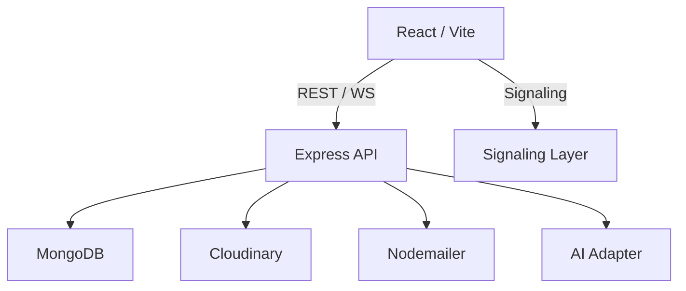

# Architecture Overview

This document explains SynapTalk's architecture from a systems and operational perspective. The focus is on implemented subsystems, data flow, operational boundaries, and evolution pathways.

## Architectural philosophy

- Small, composable services inside a monorepo: the codebase separates the client (UI + signaling) and the API (ingest, processing, delivery).
- Clear feature boundaries: routers, controllers, and models keep the server organized and observable.
- Security-first: cryptographic primitives are implemented in `server/crypto` and are integrated into message flows.
- Observability-ready: design favors measurable boundaries so metrics, traces, and logs can be added without invasive changes.

## High level components

- Client (React + Vite): UI, local crypto, WebRTC peer interactions, and REST/real-time APIs.
- API Server (Node.js + Express): authentication, message ingestion, storage, media orchestration, and admin endpoints.
- Database (MongoDB): persistent stores for users, messages, groups, and OTPs.
- Media store (Cloudinary): CDN-backed media handling for avatars and attachments.
- Third-party services: Google OAuth / Contacts, SMTP providers for email, and optional AI providers for assistant features.

## Data flows

1. Authentication
   - Users sign up / log in. JWTs are issued and used to protect API routes.
2. Messaging
   - Clients produce encrypted payloads and POST to messaging endpoints. The server stores encrypted blobs and metadata.
3. Signaling & Calls
   - Clients exchange signaling messages (offer/answer/ICE) to establish WebRTC sessions; signaling is proxied via API/socket layer.
4. Media
   - Media uploads flow to the API and into Cloudinary; the server stores CDN URLs in the DB and emits update events.

## Mermaid: system architecture

## Operational boundaries

- The API is the single source of truth for persisted data and user identity.
- Clients hold ephemeral keys for end-to-end encryption when applicable; servers never store plaintext message bodies.
- Background workers can be added to handle costly tasks such as media transcoding, index creation, and bulk decrypt operations.

## Evolution & extension points

- Introduce a queue (e.g., Redis + BullMQ) to offload heavy tasks from the request path.
- Add Prometheus + Grafana instrumentation for request and job metrics.
- Evolve signaling into a dedicated horizontally-scalable service for large concurrent call volumes.
