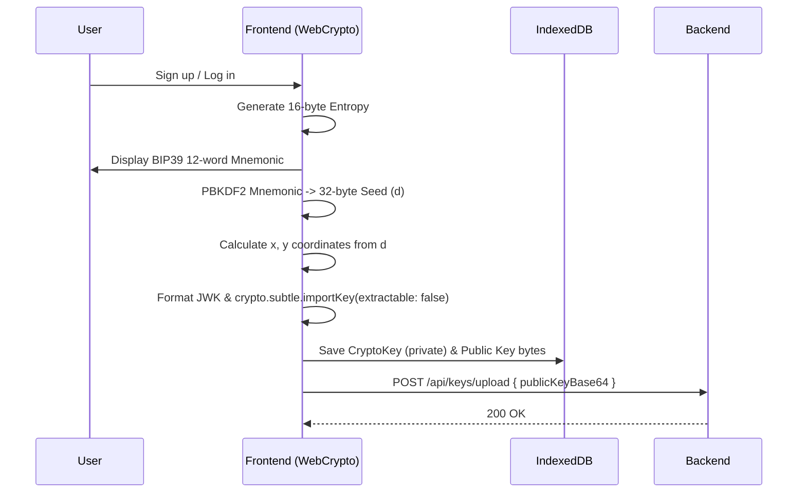
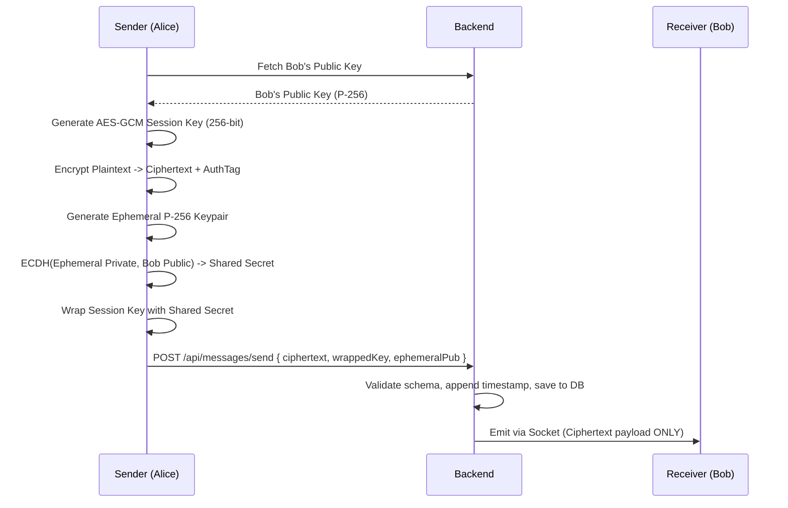
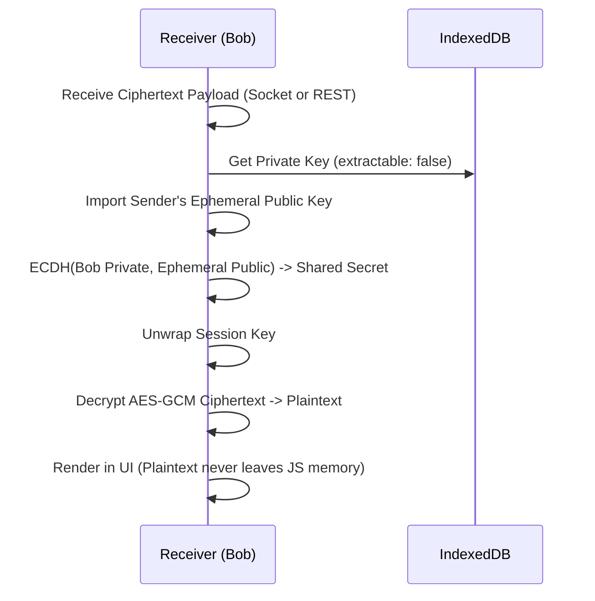
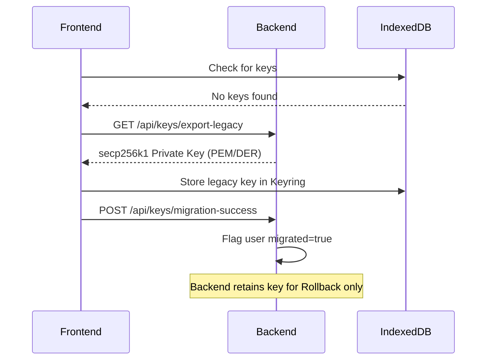
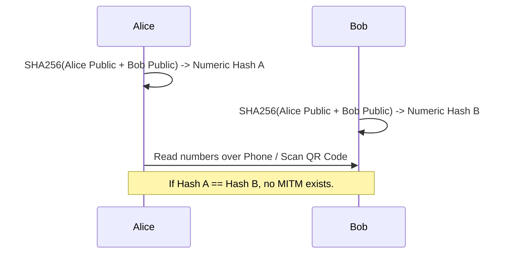

# SynapTalk True End-to-End Encryption Protocol

This document defines the strict protocol for End-to-End Encryption (E2EE) within SynapTalk. The protocol leverages native browser WebCrypto API (`P-256`, `AES-GCM`) combined with IndexedDB for non-extractable Keyring persistence, ensuring zero-knowledge routing on the Node.js backend.

## 1. Sequence Diagrams

### 1.1 Registration / Key Generation


### 1.2 Message Send (1:1)


### 1.3 Message Receive


### 1.4 Legacy Migration (secp256k1)


### 1.5 Safety Number Verification (MITM Prevention)


## 2. Payload Specifications

**Message Database Schema (`Message.js`)**:
```javascript
{
  senderId: ObjectId, 
  receiverId: ObjectId,
  cryptoVersion: { type: Number, default: 2 }, // 1 = secp256k1, 2 = P-256 WebCrypto
  senderKeyId: { type: String }, // SHA256 of Sender's active static public key
  receiverKeyId: { type: String }, // SHA256 of Receiver's active static public key
  ephemeralPublicKey: { type: String }, // Base64 SPKI
  wrappedAESKey: { type: String }, // Base64 wrapped session key
  iv: { type: String }, // 12-byte initialization vector for AES-GCM
  encryptedMessage: { type: String } // Base64 AES-GCM ciphertext (auth tag appended)
}
```

*Note: Group messaging protocols are out of scope for Phase 1 and will remain on their current SSE/Plaintext pathways until Phase 2.*
